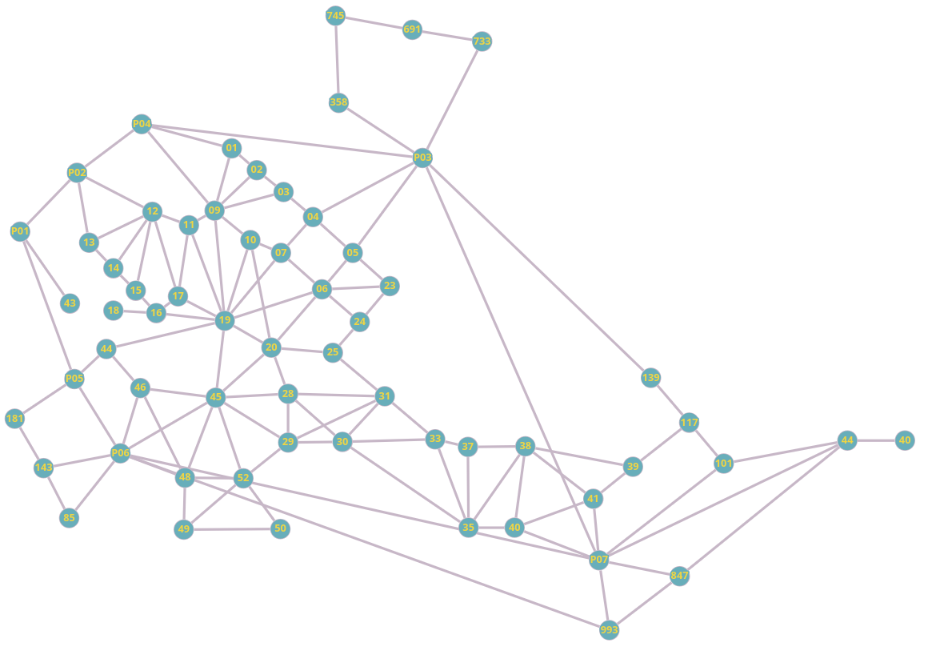

# Teoria dos grafos

## Integrantes
- Enzo Guarnieri - 10410074
- Erika Borges Piaui - 10403716
- Júlia Campolim de Oste - 10408802

[1º relatório](https://docs.google.com/document/d/1xJpaX9leEcCXHLmAk8ZejYuGFkRsiff7KOQwpLmR8yk/edit?usp=sharing)

## Definição do projeto
O objetivo deste projeto é criar um website, com foco na adaptabilidade para dispositivos móveis, que disponibiliza um mapa com a visão aérea do campus Higienópolis da Universidade Presbiteriana Mackenzie. Este mapa deve conter os principais pontos de referência da Instituição, como os prédios, lanchonetes e quadras.

Além da visão aérea, a aplicação também disponibilizará uma ferramenta de navegação para ajudar as pessoas a se locomover dentro do campus; nesta ferramenta, os usuários serão capazes de selecionar dois locais dentro da Universidade e encontrar o melhor caminho entre eles. Sendo que, o melhor caminho pode ser tanto o caminho mais curto quanto o caminho mais acessível (que evita escadas, por exemplo).

Cada local do mapa terá algumas informações básicas sobre ele, como seu nome e suas principais funcionalidades (salas de aula, laboratórios, alimentação, esportes, bibliotecas, etc.). Em adição, cada local terá uma sessão especial para informar se ele possui algum ponto de coleta de material reciclável, como a coleta de eletrônicos localizada no prédio 31 da Faculdade de Computação e Informática.

Dessa forma, a aplicação deverá facilitar a locomoção de pessoas pelo ambiente universitário, principalmente pessoas que ainda não possuem familiaridade com o campus, e irá promover o descarte sustentável de materiais recicláveis, que muitas vezes não são descartados corretamente.

Para mapear os locais do campus, o grupo optou pelo uso de um grafo não direcionado e ponderado nas arestas, onde os vértices representam os prédios dentro da Universidade e as arestas o caminho entre eles. Para uma modelagem inicial do problema, foi utilizado a ferramenta Graph Online, onde os vértices foram posicionados de modo semelhante ao seu posicionamento na vida real.

Figura 1: Protótipo do grafo. Link: <a href="http://graphonline.top/?graph=MbVhwpCLhYabzWjk" target="_blank">http://graphonline.top/?graph=MbVhwpCLhYabzWjk</a>.

Este grafo foi usado como base para a coleta de distâncias entre os locais do campus.

Para a parte inicial do projeto, o único dado armazenado nos vértices é o seu rótulo. O grupo preferiu essa abordagem para a organização do arquivo que será lido com os vértices e suas ligações. A leitura de outras informações do prédio fará mais sentido com a leitura dos dados de um banco de dados.

### Objetivos da ODS

Um dos objetivos do projeto MackMap é disponibilizar informações de pontos de coleta de materiais recicláveis dentro do campus Higienópolis da Universidade Presbiteriana Mackenzie, como o ponto de coleta de eletrônicos localizado dentro do prédio 31 ou o ponto de coleta de esmaltes (extremamente poluentes se descartados da forma errada) na portaria da Piauí. 
Portanto, para o projeto, podemos associar a ODS 12 - Assegurar padrões de produção e consumo sustentáveis.

